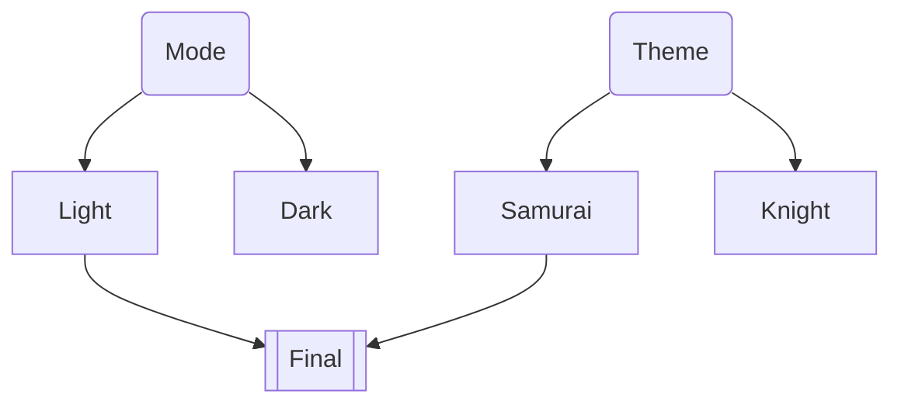
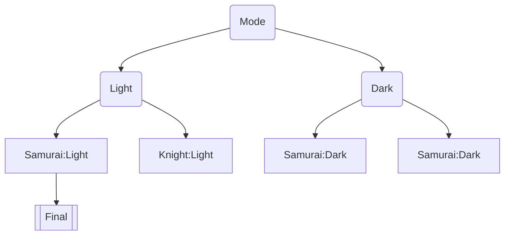
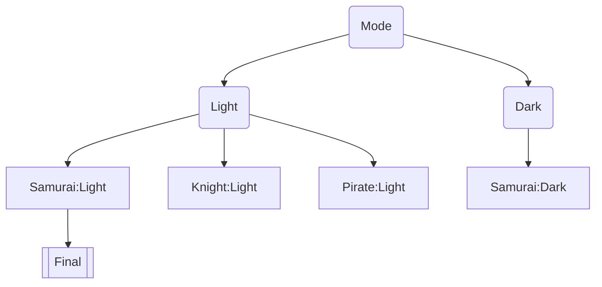
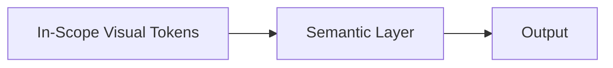

Please see the [json schema](/reference/schema) for this for a more rigid definition, or check out the [example](/reference/example)

## Context and Problem Statement

> This proposal was spurred on by a post in the design tokens community regarding [modes and theming support](https://github.com/design-tokens/community-group/issues/210) in tandem with feedback from users of the [Tokens Studio Figma plugin](https://github.com/tokens-studio/figma-plugin). Many of the mentions of specific users are with respects to this initial post.

Many users of design tokens use theming, such as the use of light and dark mode in their designs to show different variations. Themes and modes are not the only dimensions however, and many users end up using more complex ways to partition their tokens to account for this.

To manage these tokens amd their various combinations, users usually end up adopting complicated naming taxonomies to keep all of the tokens unique within a global namespace.


These solutions via naming are overly brittle, and in practice most users end up separating their various dimensions like `theme`, `mode` `variant` ,etc into different sets which are intended to override each other. The is also used to circumvent issues of changing tokens when using tools that attach a token directly on a design element.

How can we support arbitrary partitioning of tokens into sets with stable token names that can be used in design tools when swapping between these dimensions, preserve semantics, whilst also keeping tokens easily consumable by end tools?

## Parameters

It's important to setup some parameters to tailor the discussion of a proposal around:

1. As @lukasoppermann mentions, files should still be simple enough to be edited by hand. Tooling as it currently stands has not reached the point of maturity where the system is fully automated. Additionally for a new spec it should be simple enough for new users to dip their toes in and test the viability of the solution.

2. Scalability. This proposal is currently addressing adding support for modes and themes which are two additional dimensions for token resolution. In a real world case for larger systems there might be significantly more dimensions, such as the brand, surface, etc, so whatever solution we provide should be able to handle an arbitrary amount of dimensions.

3. Simplicity. Referring back to point 1, we don't want to complicate the existing spec for tokens. If we do we end up polluting the spec with responsibilities outside of its core intent of just providing a simple and extensible way to define tokens. Thus we should externalize the logic concerned with handling these additional dimensions outside of the actual token files themselves.

Using the above parameters, the proposal is that we create standalone resolver files which represent the different ways in which a token can be resolved.

## Background

This approach is based on the existing work in the [Tokens Studio Plugin](https://github.com/tokens-studio/figma-plugin) which currently supports multidimensional tokens through the use of its `$themes.json` file that it exports with the following shape

```json5
[
  {
    // An arbitrary generated id as a hex string
    id: '12323422b00f1594532b34551306745622567a',
    name: 'brand',
    selectedTokenSets: {
      // A set that is used to resolve references
      'tokens/core': 'source',
      // A set expected to be used in the output
      'tokens/semantic': 'enabled',
    },
  },
]
```

Using this, they are able to support multiple dimensions by using token sets as `sources`, which means they are able to be referenced for aliases, but do not contribute to the final token values and `enabled` sets which are then flattened in order to get the final values of the resulting token set once all transformations have been applied.

An example of this in action would be the following where the brand X has different combinations of themes by selecting a combination of differents sets to form that multidimensional theme :

```json5
[
  {
    //An arbitrary generated id as a hex string
    id: '2f440c32b00f1594532bf5b051306724e22136a',
    name: 'Brand X | Light theme',
    selectedTokenSets: {
      'brand/x/foundation/color/light': 'source',
      'foundation/color/appearance': 'source',
      'foundation/dimensions': 'source',
      'mode/light': 'enabled',
      'semantic/actions': 'enabled',
    },
  },
  {
    id: 'aa7e80632359bcfc4e09761f8d8f235d02eb41d7',
    name: 'Brand X | Dark theme',
    selectedTokenSets: {
      'brand/x/foundation/color/dark': 'source',
      'foundation/color/appearance': 'source',
      'foundation/dimensions': 'source',
      'mode/dark': 'enabled',
      'semantic/actions': 'enabled',
    },
  },
]
```

:::note
The token sets used are typically larger than what is shown and there are cases where there are 40+ sets
:::

There are a number of problems to this approach though. This is currently being applied to create a single addressable space for tokens and is not granular. If you wanted to create a much smaller set that represented each component for example, you could not as the output of the set resolution is a single named token set that is then used to reference the tokens.


:::note
The references to the tokens used in this styling are tied to a single addressable token space
:::

Whilst you could add more token sets as enabled if you wanted a button component by adding `comp/button` under `comp/body` for example, unless you are following strict naming, your button set might clash with other named tokens in the final generated token set. It is very likely that you would want to define dimensionality on a per component basis if your design system were evolving as well, so that new designers who were onboarding were not overwhelmed by the existing complexity of the system and can focus on isolated components.

> In this we find the next property for the resolver that we would need to specify which is specificity. Different components might want to resolve in an isolated manner
> with different modifiers that might not be global or follow a different patterm

@jjcm mentions this as well. Modes are based on how the sets want to be consumed by a user, and are not a property of the set themselves, hence why it also makes sense to use standalone files outside of the token spec to define these and apply them independently.

## Motivation

Now that you have some background information and the problem statement, it makes sense to [check out the spec itself](/reference/example) before reading the next part.

### Why this approach over the current `$themes` approach?

1. Having named enumerated possibilities indicates to documentation systems the different possible dimensions. E.g. a button resolver could be identified as supporting 3 different brands, 2 modes and 4 themes for example. This is something that cannot be inferred currently. As @romainmenke mentions all possible permutations must able to be detected for code generation tools. By explicitly defining the possible values, this should help.

> A point to mention alongside this is the detection of [orthogonality](#orthogonality) surrounding the modifiers. Certain modifiers might override all others, eg `disabled` which might be a boolean. This might not potentially interact with any other modifier and as such is orthogonal to them and does not result in a value in the permutation matrix

2. Lower cognitive load. As mentioned keeping all of this within a single global namespace with $themes means a designer needs to keep track of all the different tokens that are currently being used. If they could instead focus purely on logic related to a component, surface, etc by reducing the scope of tokens involved they can intuit the relations between tokens and sets easier.

3. Faster resolution. For enterprise systems that have potentially thousands of tokens with multiple combinations, getting the final values becomes very slow assuming O(n) resolution time multiplied by O(m) for each dimension. By reducing the amount of tokens in scope, this should be significantly faster. Also since the relationships for which sets consume which other sets are within the resolver, a system could also know which resolvers to cache and which to re-evaluate

4. Context sensitive design. For cases where context sensitive design is needed we could use contexts to pass through values as inputs to the resolver. An example would be surface logic. A button might change its values in response to the surface its placed on. In a Figma environment this could be implemented by storing a context object at different points of the document tree and then merging it together with a component input to react to whatever it is being placed into. Multiple different points of context could exist within the tree. For example the top level node might set the brand, while a frame within it might set the theme, and within it the surface. These values could be merged together in addition to say a buttons input to determine the final tokens that are in scope.

5. Removing global changes. $themes are changed at the top level and affect everything. Trying to show two or more examples of a component in different multidimensional configurations next to each other requires strict naming to be enforced and references to tokens that might not exist in an enabled or source set in the configuration

### Why is this preferred over embedding `$modes`?

As mentioned before, a single dimension is not sufficient. Even if we were to add `$themes` in addition to a `$mode` it would be a matter of time until a design system needed to support additional logic or logic that depends on other values.

### Pros

1. The spec for a resolver can still be kept fairly simple and should still be possible to be handwritten by a human.

2. We can support an arbitrary amount of modifiers as well as keep the execution time quick even if permutating all possible values by keeping the amount of tokens in scope small by making resolvers that operate only on specific sets. @gossi mentions that larger design systems will likely end up with permutations around ~144.

3. The token spec does not need to be extended as we are not embedding the resolution logic with the data. This helps seperates concerns between the data and its actual usage.

4. By removing fallbacks from the proposal we don't have to worry about edge cases like @jjcm mentioned with the following.

```json
{
  "$name": "intent-action-base-background",
  "$value": [
    {
      "$value": "white"
    },
    {
      "$value": "darkgrey",
      "color-scheme": "dark"
    },
    {
      "$value": "black",
      "color-scheme": "dark",
      "color-contrast": "high"
    }
  ]
}
```

```js
const token = tokens.find((t) => t.name === 'intent-action-base-background');
const value = token.value.find({
  colorContrast: 'high',
});
```

As this should be an error if token references are not resolved fully during the resolution.

## Resolution logic

The resolution logic is fairly simple. Let's assume that a resolution request comes into a tool programmed in javascript

```js
// Any acceptable resolver definition
const resolver = //...

const inputs :{
  theme:'dark'
  // Additional inputs
}

// async as sourcing tokens from arbitrary storage locations is likely not synchronous
await resolve(resolver, inputs);
```

The resolve function would perform a number of steps

1. Validate the inputs. Input types such as the `enumerated` type have specific named values that are acceptable. If these are not matched by the provided input, throw an error and fail.

2. Read the input sets and flatten them into a single new set

3. Select the appropriate modifiers and read the token files

4. Perform optional aliasing on the modifier sets if required

5. Replace input sets if using `include` modifiers

6. Flatten the modifiers into a single new set

7. Resolve the aliases of the input set using values from the modifier set if a value is not found in the input set.

The output of the resolution is a new token set. This token set can then be consumed by any [export tools](https://second-editors-draft.tr.designtokens.org/format/#export-tools) if need be as it is just a simple token set.

## Example calculation

We want to resolve the provided resolver:

```json
{
  "sets": [
    {
      "values": ["foundation.json", "semantic.json", "button.json"]
    }
  ],
  "modifiers": [
    {
      "name": "theme",
      "values": [
        {
          "name": "light",
          "values": ["light.json"]
        },
        {
          "name": "dark",
          "values": ["dark.json"]
        }
      ]
    }
  ]
}
```

</details>

with the input

```json
{
  "theme": "light"
}
```

We first validate that there is a modifier called `theme` that has an acceptable input value of `light`, then load the necessary sets.

Let's assume the following tokens structures for the example:

`foundation.json`

```json
{
  "gray": {
    "$value": "coolgray",
    "$type": "color"
  },
  "padding": {
    "$value": "4px",
    "$type": "dimension"
  }
}
```

`semantic.json`

```json
{
  "primary": {
    "$value": "{theme.accent}"
  }
}
```

`button.json`

```json5
{
  padding: {
    $value: '8px',
    $type: 'dimension',
  },
}
```

We first squash all the above tokens into a single set that will be resolved with the modifier

| Name    | Set        | Value          | Overriden |
| :------ | :--------- | :------------- | :-------- |
| gray    | foundation | coolgray       |           |
| padding | foundation | 4px            | ✓         |
| primary | semantic   | {theme.accent} |           |
| padding | button     | 8px            |           |

This results in :

```json
{
  "gray": {
    "$value": "coolgray",
    "$type": "color"
  },
  "primary": {
    "$value": "{theme.accent}"
  },
  "padding": {
    "$value": "8px",
    "$type": "dimension"
  }
}
```

Now the modifiers are :

`light.json`

```json
{
  "accent": {
    "$value": "lightblue", // for our light theme we want a lighter shade of blue
    "$type": "color"
  }
}
```

`dark.json`

```json5
{
  accent: {
    $value: 'darkblue', // for our dark theme we want a darker shade of blue
    $type: 'color',
  },
}
```

Note in actual system that implement resolver logic we would not need to load both light and dark json files, only what is specified in the modifier. We show both here for illustrative purposes.

Assuming `light` was picked as the theme, we would first alias the light set using `theme` and flatten the values, resulting in :

```json5
{
  // These tokens are referenced by the input values and thus we will see them reflect in the output
  theme: {
    accent: {
      $value: 'lightblue', // {theme.accent} = lightblue in light.json
      $type: 'color',
    },
  },
  // If there are additional tokens defined here that are not referenced by input values they will not be part of the output
}
```

Now resolution would occur. We iterate through the tokens within our input set till we find any that require reference resolution and resolve them first using any values found in the input set, falling back to the modifier set as necessary. In this case `primary` contains a reference to `theme.accent`. The key `theme.accent` does not exist within the input set so we look at the modifier set, and find it. We then perform a replacement within the input set resulting in :

```json5
{
  primary: {
    $value: 'lightblue',
    $type: 'color',
  },
  gray: {
    $value: 'coolgray',
    $type: 'color',
  },
  padding: {
    $value: '8px',
    $type: 'dimension',
  },
}
```

**Note** if `theme.accent` had itself been a reference, we would recursively resolve the reference using the same logic.

## Usage with export tools

For large design systems that might have multiple brands, the resolution of their tokens as they are finally consumed by the frontend code might be permuting multiple modifiers whilst holding other constant. Eg in an example webapp, the brand `foo` is known up front and will be the only such value, however the app supports multiple themes and modes.

Either multiple resolvers could be defined on a per brand level or the value of the brand in a single resolver could be held constant whilst evaluating the combinations of the other modifiers.

This would likely be an architectural descision depending on whether the brands have anything in common or not or otherwise require seperate resolvers for governance reasons.

@connorjsmith makes a valid point of the final tools such as `style-dictionary` deciding the final form of the tokens as a list of css variables, as well as optimizing the final form. Two resolved sets, with light and dark mode set respectively for example, could then be analyzed to optimize the final form of the tokens and removing redundant values .

## Resolution aliasing

Consider the following set called `size.json`.

```json5
{
  sm: {
    $value: '1px',
    $type: 'dimension',
  },
  lg: {
    $value: '10px',
    $type: 'dimension',
  },
}
```

Let us assume that we want this file to be namespaced so that we can reference this in one of the sets to be resolved. Altering the file directly is not a good solution as it might introduce naming brittleness, as well as potentially have a number of other restrictions like being read-only, owned by someone else, etc.

:::note
This also speaks to an assumption we have never mentioned before. It is being assumed right now that everyone is in complete control of their sets, but if we want to support someone referencing another token set(s) eg Material, they should be able to just reference the values without having to modify them, similar to how we import modules in programming.
:::

Rather we could dynamically namespace this when its loaded into the system through an alias like `foo` to result in

```json
{
  "foo": {
    "sm": {
      "$value": "1px",
      "$type": "dimension"
    },
    "lg": {
      "$value": "10px",
      "$type": "dimension"
    }
  }
}
```

This allows us to consume other peoples token libraries without directly modifying their files.

### Real world use case

The GitHub Primer token sets can be used as an example of applying the resolver to a large system.

The theme specifier [here](https://github.com/primer/primitives/blob/63cc53911bada7ed17cdfbec8a4c99b0a38507f9/scripts/themes.config.ts#L64) shows a case where we have two dimensions, the `light` and `dark` mode, in tandem with a visual impairment dimension that supports:

**Light**

- General
- Tritanopia
- Standard Colorblindness
- High contrast

**Dark**

- General
- Dimmed
- Tritanopia
- Colorblind
- High contrast

> Note the addition of `dimmed`. This will be relevant to show where architectural choices might affect how resolvers are used.

Starting with the `light` mode, we see that there are common sets purely used to reference that should not be used for the output.

These are the `src/tokens/base/color/light/light.json5` set and the `src/tokens/base/color/light/light.high-contrast.json5` which is used for `light-high-contrast`. Since the `src/tokens/base/color/light/light.json5` is used for all values, this could be set as a `include` in the modifiers

:::note
In this case we are assuming that this resolver exists in the `src/tokens` folder
:::

```json
{
  "sets": [
    {
      //The current solution expects to get actual values from the light and dark base sets as the output. As this is dynamic depending on the dimension. We include an empty set here which will be overriden by the modifier
      "name": "theme",
      "values": []
    }
  ],
  "modifiers": [
    //This is a common set that is used for all resolutions, but is not expected in the output so we use it purely for context
    {
      "name": "base",
      "type": "enumerated",
      "default": "common",
      "values": [
        {
          "name": "common",
          "values": ["src/tokens/functional/color/scales.json5"]
        }
      ]
    },
    {
      "name": "theme",
      "type": "include",
      "default": "light",
      "values": [
        {
          "name": "light",
          "values": ["base/color/light/light.json5"]
        },
        {
          "name": "dark",
          "values": ["base/color/dark/dark.json5"]
        }
      ]
    },
    // An example of a repeated modifier.
    // The above performs a different action to the below defined
    // modifier with this providing a context source to read from
    {
      "name": "theme",
      "type": "enumerated",
      "default": "light",
      "values": [
        {
          "name": "light",
          "values": [
            "src/tokens/functional/shadow/light.json5",
            "src/tokens/functional/border/light.json5"
          ]
        },
        {
          "name": "dark",
          "values": [
            "src/tokens/functional/shadow/dark.json5",
            "src/tokens/functional/border/dark.json5"
          ]
        }
      ]
    }
    // etc, we add visual modifiers for each of the common visual modifiers
  ]
}
```

Since the high contrast set is included, but _only_ if it is using this modifier, we use a `include` modifier

```diff
{
  "modifiers": [
    // ...
    {

      "name": "visual",
      "type": "enumerated",
      "default": "general",
      "values": [
        {
          "name": "general",
          // ...
        }
        // ...
      ]
    },
+    {
+      "name": "visual",
+      "type": "include",
+      "default": "",
+      "values": [
+        {
+          "name": "high-contrast",
+          "values": ["base/color/light/light.json5"]
+        }
+      ]
+    }
  ]
}
```

## Orthogonality

Within the possible dimensions we identify a concept of orthogonality to determine if one dimensions is independent of another. In laymen's terms, can a modifier change freely without needing to change how resolution of another modifier works. The following diagrams illustrate this point.

In this first diagram, two independent sets are used to resolve the final value. Any change to the `Mode` choice does not affect the theme set used.



In this diagram, the choice of mode combined with the theme changes which set is used for final resolution. If the `mode` modifier is changed, the choice of potential candidates for `theme` changes as well



In the above example we purposefully chose values such that the we had balanced options where each mode has the same options to choose from, lets now see an example where this becomes unbalanced



In this case the choice for resolution becomes contextual. ONLY if the chosen mode is `Light` do you have the option of choosing the `Pirate` theme and if you do chose both `Dark` and `Pirate` you have made an invalid selection.

This is a basic example using only 2 modifiers but once other modifiers such as "Brand", "Surface", etc are included into the mix, more logic would be necessary to both handle the resolution of this, and also to express what combinations are allowed. This adds complexity to the overall solution.

## Future extensions

We have attempted to keep the resolver structure as basic as possible outside of some minor additions like the name and description that could be useful.

As part of extensions for the spec, we might want to have a resolver potentially refer to another resolver so that certain calculated sets might be blackboxed. This might take the form of using a different `type` in the modifiers object to specifiy a `resolver` as opposed to an `enumerated` or `include` type which might reference a resolver.

This is only really useful if we cannot create precomputed token sets, but might have its uses otherwise. An example of such might be to relay context to another resolver to simulate properties such as surface logic.

In the example shown, if the visual modifier could not be normalized to be completely orthogonal to the mode, via the use of a semantic layer which could handle the mapping, ie



and the choice of sets is dynamic because of it, eg `src/tokens/functional/color/light/overrides/light.protanopia-deuteranopia.json5` vs `src/tokens/functional/color/dark/overrides/dark.protanopia-deuteranopia.json5`,
then the output would depend upon the mode modifier for the visual modifier. To prevent overloading the complexity of one resolver for the different dimensions, one resolver would just read the output of another resolver either directly or through a precomputed set as previously mentioned. The alternative would be to change the resolver specification to express the acceptable combinations through the use of a tree structure that could be pruned. Looking back at our example of a non orthogonal modifier structure :


Assuming this is valid and enforceable, this also reduces the space to only `4` sets as opposed to the `3 x 2 =6` permutations for each `mode` with each `theme`. For design systems that want to use a resolver spec as a source of truth, they could use it to construct a graph showing the different possible variations of a component, making it explicit which combinations are valid and invalid for the different dimensions. This could likely be useful in cases where the choice of the `brand` dimensions heavily affects the possible values of the other modifiers as brands might offer completely different combinations. This should likely be addressed by the use of seperate resolvers if they are heterogenous in their modifier usage, but regardless this could be more efficient for export tools.

As @romainmenke mentioned there will likely need to be some form of bridge connecting the possible values of a token and then providing some form of metadata to it to then be used in the various platforms, likely some form of output with conditional rules. Seeing as this is likely going to be dynamic as it needs to be evaluated at runtime (eg screen size) its outside the scope of what the resolver on its own might do without some additional system that could be embedded into a front end to do this.

A modifier that is not acceptable for this form of resolving is an example such as component state. A component can exist in multiple different potential states, eg Focused, Hover and in Error state, and each of these states might have different levels of precedence, such as the red color of the background always being shown.

Lastly the Primer examples shows an interesting point of using glob based selection of the sets. This could be useful in solving the issue shown above with regards to the file paths of the visual afflictions being dependent on the mode. If we potentially allow string interpolation based on the modifer inputs that could simplify the structuring and not require refactoring of semantic layers to enable this approach
